<h1 align=center>Der Chatbot</h1>

    </img>
    <h3>Startseite</h3> 

    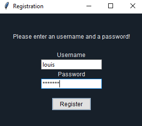</img></img>

<h2>Das Chatfenster</h2>

    </img>

 

    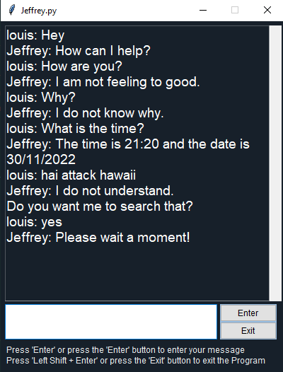</img>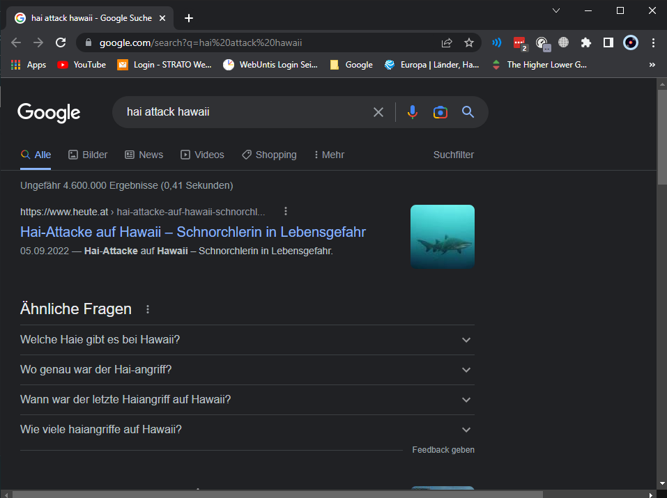</img>

 

    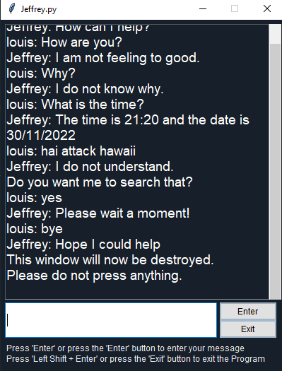</img>

<h1 align=center>Der Code</h1>

<h2>Data.json</h2>

    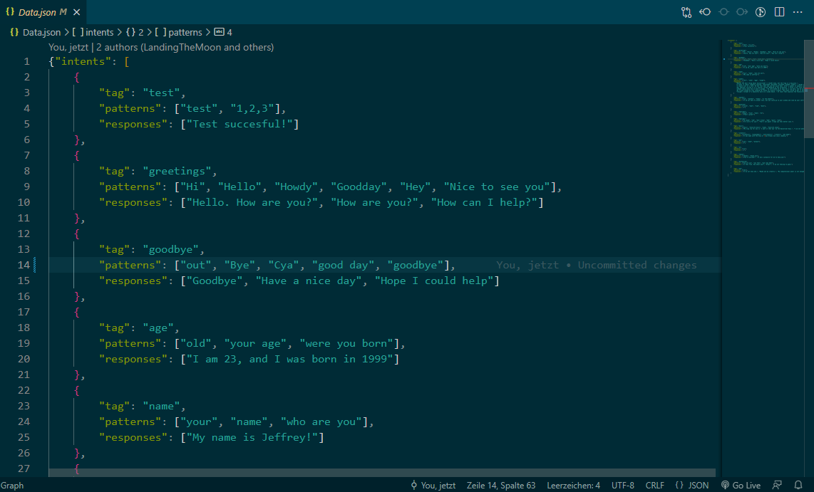</img>

<h2>nltk_utils.py</h2>

    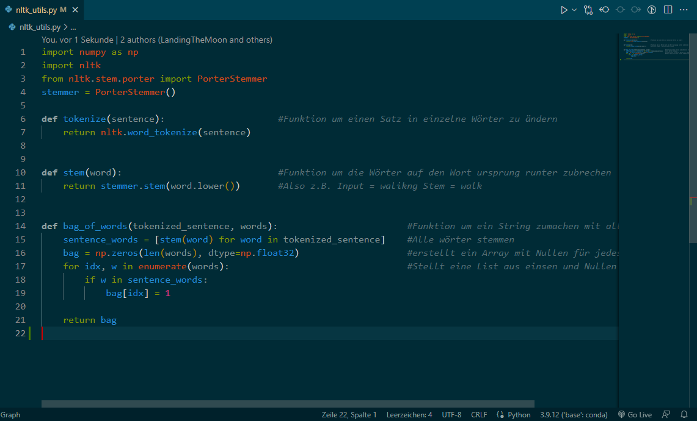</img>

<h2>model.py</h2>

    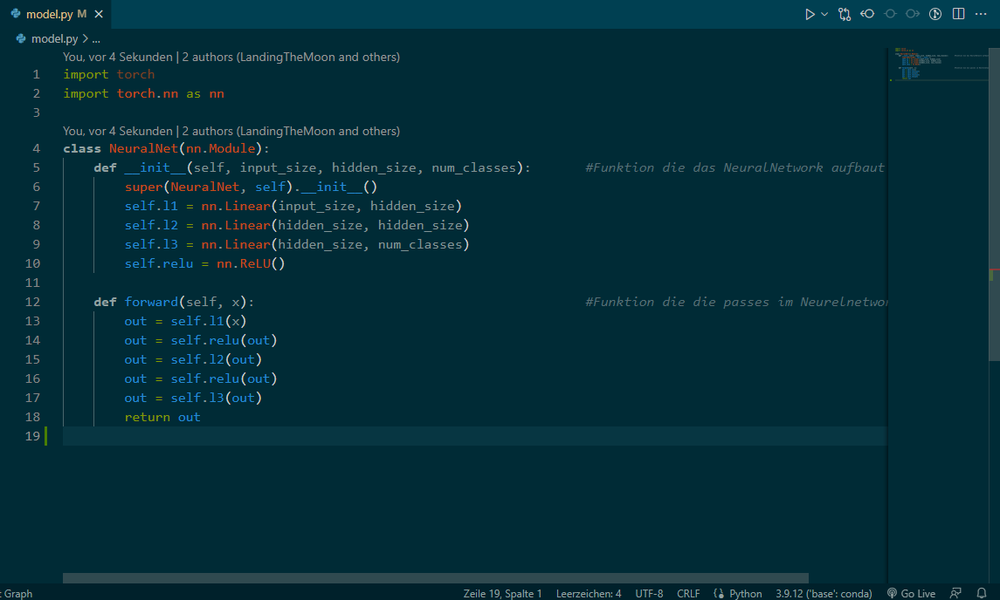</img>

<h2>train.py</h2>

    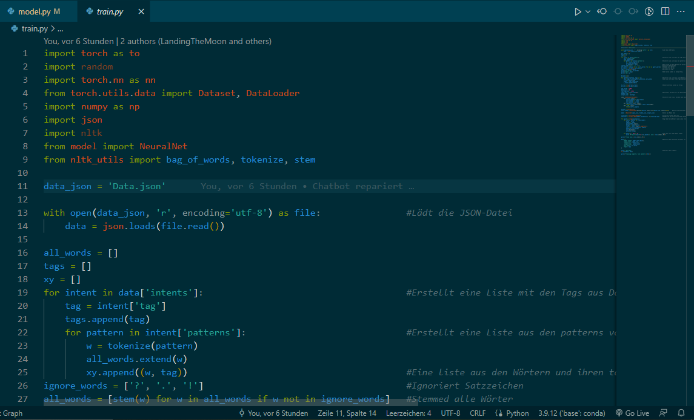</img>

 

    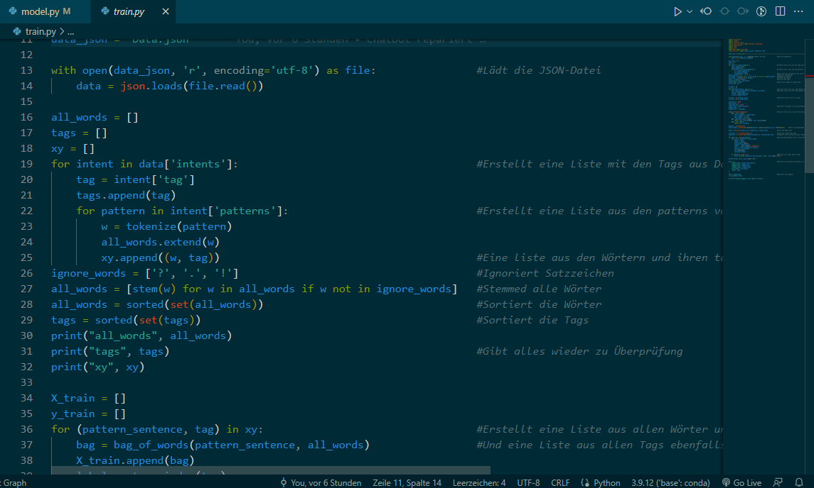</img>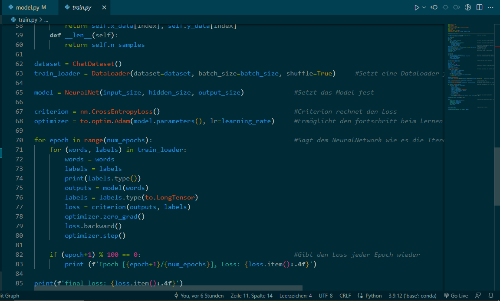</img>

<h2>chat.py</h2>

    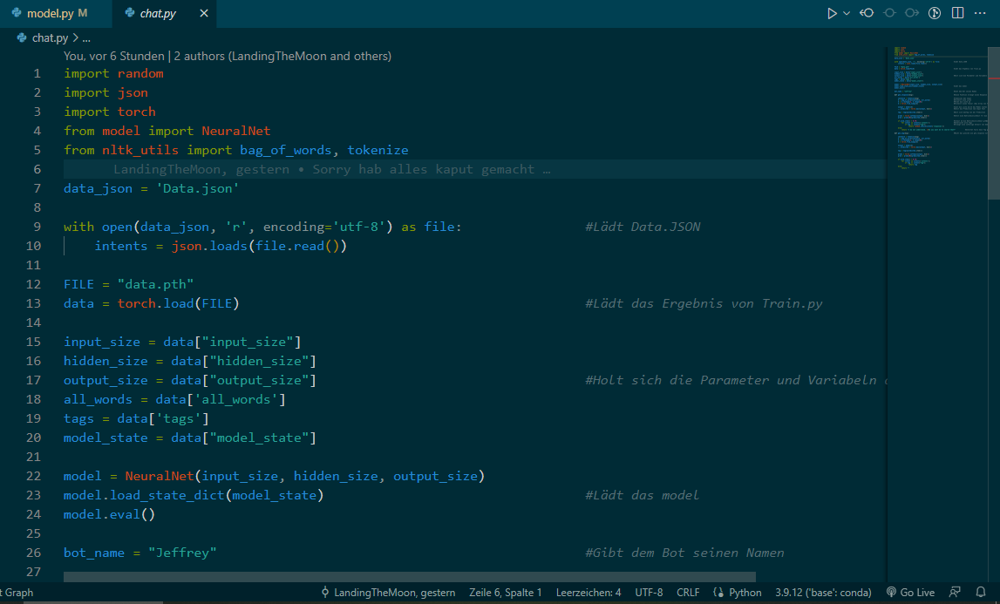</img>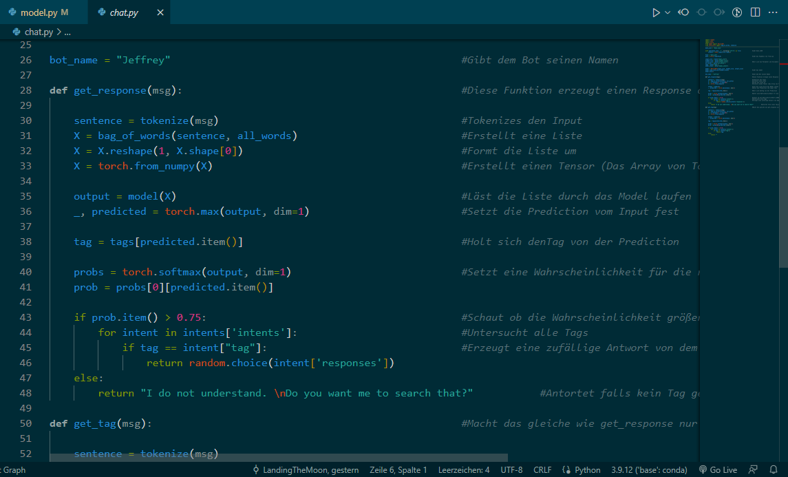</img>

<h2>gui_chatbot.py</h2>

    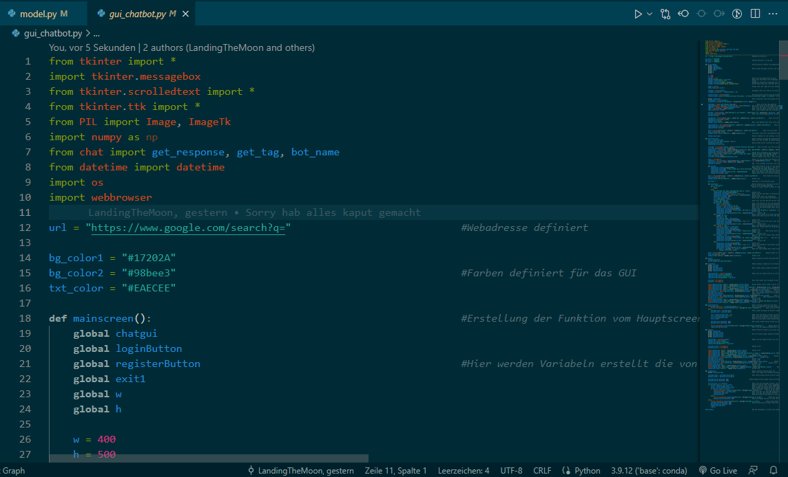</img>

 

    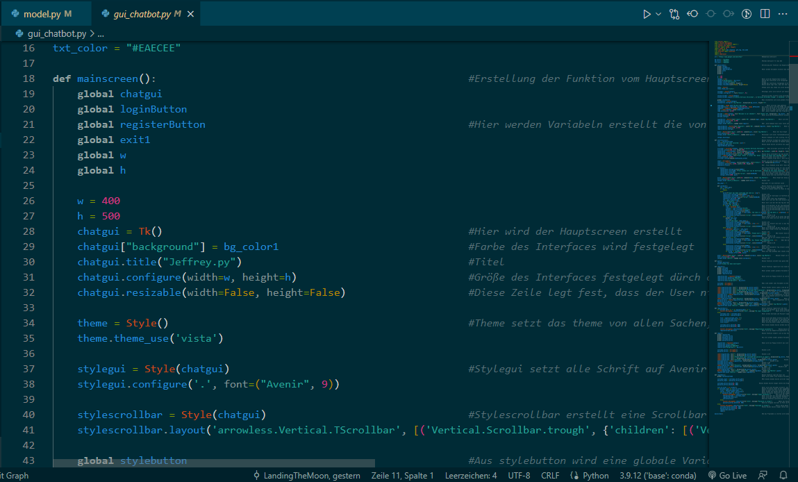</img>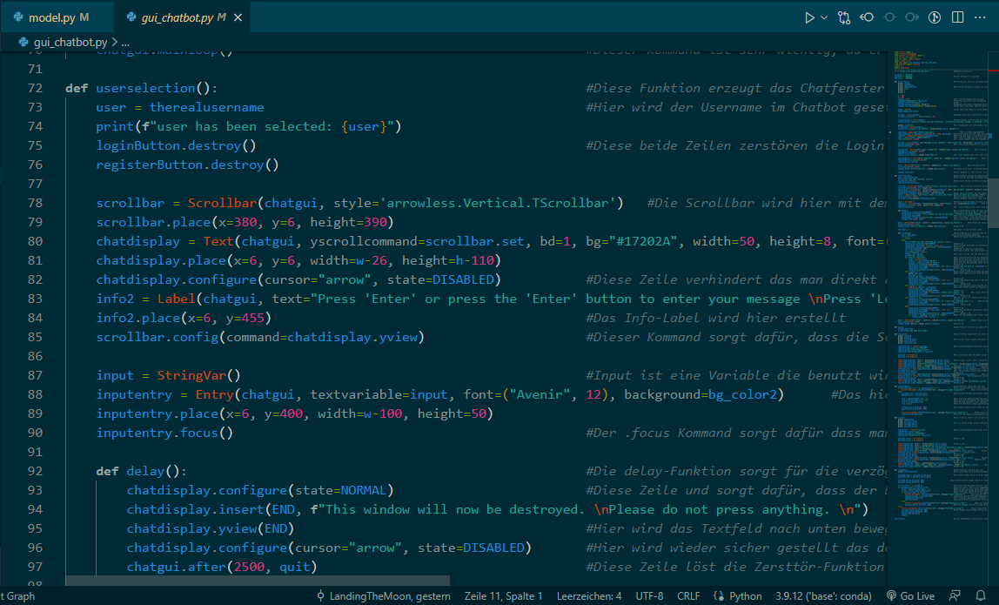</img>

 

    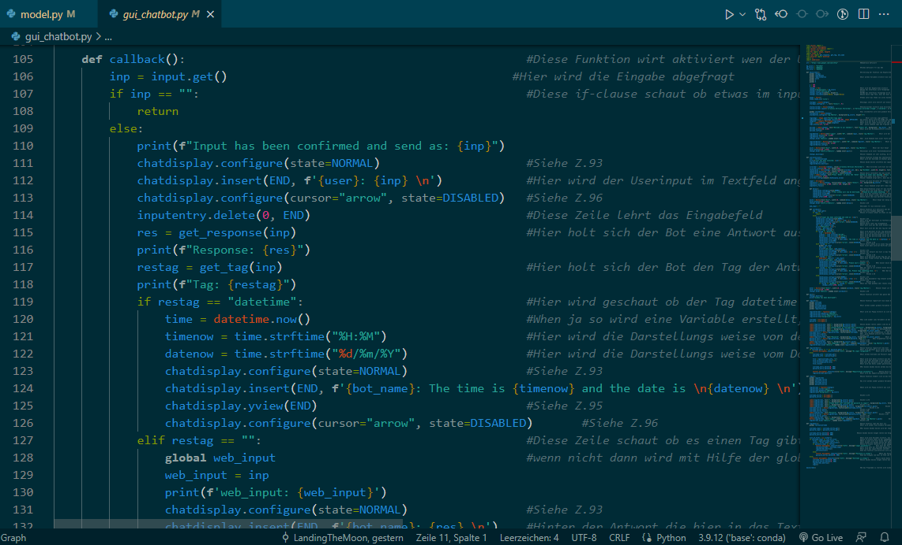</img></img>

 

    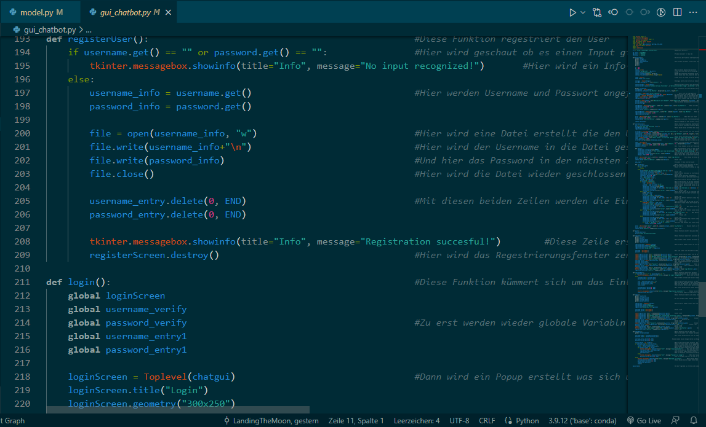</img>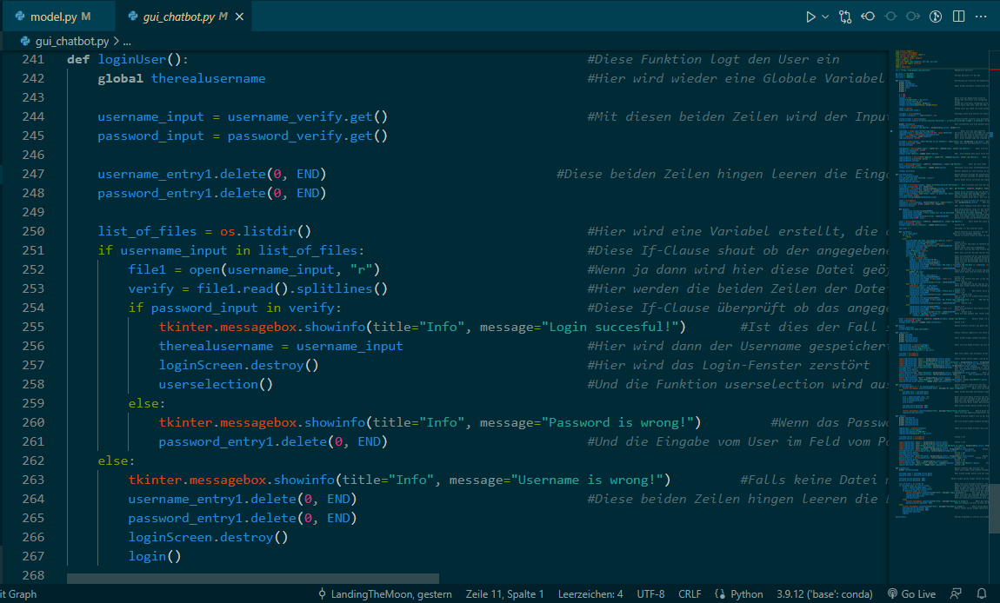</img>

