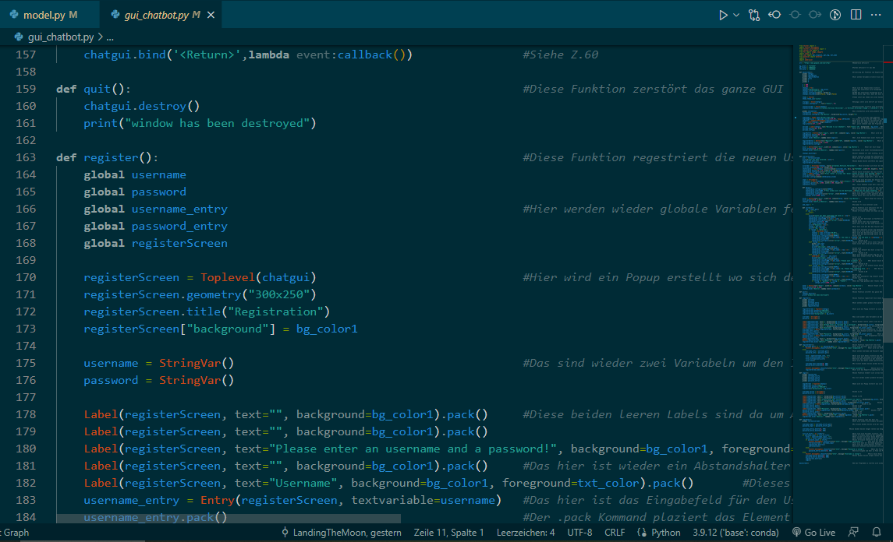

<h1 align=center>Der Chatbot</h1>

    </img>
    <h3>Startseite</h3>

    </img></img>

<h2>Das Chatfenster</h2>

    </img>

<table align=center>
    <tr>
        <td>
            </img>
        </td>
        <td>
            </img>
        </td>
    </tr>
</table>

    </img>

<h1 align=center>Der Code</h1>

<h2>Data.json</h2>

    </img>

<h2>nltk_utils.py</h2>

    </img>

<h2>model.py</h2>

    </img>

<h2>train.py</h2>

    </img>

    </img></img>

<h2>chat.py</h2>

    </img></img>

<h2>gui_chatbot.py</h2>

    </img>

    </img></img>

    </img></img>

    </img></img>

