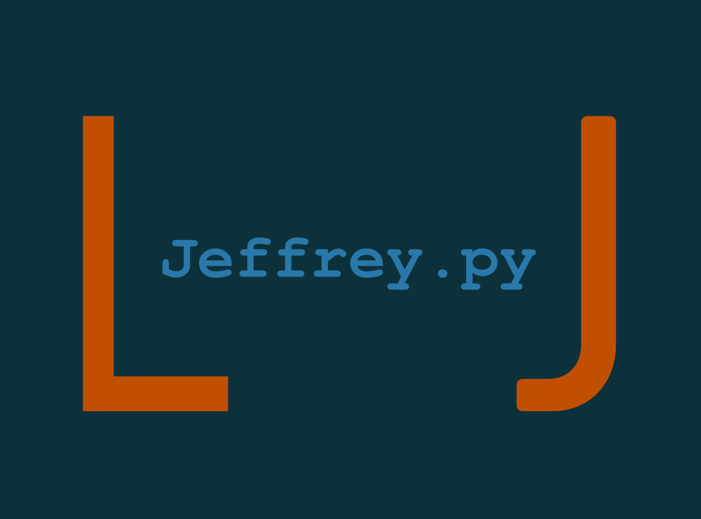

<h1 align=center>Chatbot mit Neural Network - Projektseite</h1>
<div align=center>
    </img>
</div>
<h3 align=center>von Jan Drewes (@LandingTheMoon) & 
Louis Lemberg (@MindOfUs)</h3>


## Übersicht

<ol>
    <li>
        <a href="#einführung">Einführung</a>
        <ol>
            <li>
                <a href="#gruppe">Die Gruppe</a>
            </li>
            <li>
                <a href="#idee">Die Idee</a>
            </li>
        </ol>
    </li>
    <li>
        <a href="#programme">Die verwendeten Programme</a>
        <ol>
            <li>
                <a href="#python">Python (Programmiersprache)</a>
            </li>
            <li>
                <a href="#vscode">VisualStudio Code (Programmierumgebung)</a>
            </li>
            <li>
                <a href="#anaconda">Anaconda (Distributionssoftware/Interpreter)</a>
            </li>
            <li>
                <a href="#pytorch">Pytorch (Neural Network)</a>
            </li>
            <li>
                <a href="#nltk">NLTK (Natural Language Toolkit)</a>
            </li>
            <li>
                <a href="#tk">tkinter (GUI)</a>
            </li>
        </ol>
    </li>
    <li>
        <a href="#chatbot">Der Chatbot</a>
        <ol>
            <li>
                <a href="#data">data.json</a>
            </li>
            <li>
                <a href="#nltk">nltk_utils.py</a>
            </li>
            <li>
                <a href="#model">model.py</a>
            </li>
            <li>
                <a href="#train">train.py</a>
            </li>
            <li>
                <a href="#chat">chat.py</a>
            </li>
            <li>
                <a href="#gui">gui_chatbot.py</a>
                <ol>
                    <li>
                        <a href="#user">def userselection()</a>
                    </li>
                </ol>
            </li>
        </ol>
    </li>
    <li>
        <a href="#ausführen">Wie führt man den Chatbot aus?</a>
    </li>
    <li>
        <a href="Design vom Chatbot.md">Design vom Chatbot und Fotos vom Code</a>
    </li>
    <li>
        <a href="Stundenprotokoll.md">Stundenprotokoll</a>
    </li>
    <li>
        <a href="#sources">Quellen</a>
    </li>
    <li>
        <a href="#eigen">Eigenständigkeitserklärung</a>
    </li>
</ol>

## Einführung <a name="einführung"></a>

Im ersten Abschnitt unserer Projektseite werden wir zuerst einmal unsere Gruppe, sowie unsere Projektidee erklären.

### 1. Die Gruppe <a name="gruppe"></a>

Unsere Gruppe besteht aus Jan Drewes und Louis Lemberg, wir gehen beide in das Physikprofil der 11. Klasse. Für uns war von Anfang an klar, dass wir zusammen arbeiten wollen, da die Zusammenarbeit in anderen Projekten schon sehr gut funktioniert hat. Wir beide sind schon mit Grundkenntnissen in der Programmierung durch kleinere vorausgegangenen Projekte in dieses Projekt gestartet. Deswegen haben wir uns eine etwas kniffeligere Aufgabe ausgesucht.
Bei uns gab es zu Beginn jedoch abgesehen von dem Projekt eine kleine extra Herausforderung, denn Louis war für die Zeit bis zu den Herbstferien wegen eines Schüleraustauschs in Frankreich. Dort hat er angefangen an dem Projekt zu arbeiten. 

### 2. Die Idee <a name="idee"></a>

Bei der Ideenfindung haben wir uns am Anfang sehr schwer getan. Eigentlich hätten wir gerne ein Projekt mit einem Arduino gemacht, da für uns beide die Arbeit mit einem kleinen Computer sehr spannend schien. Diese Idee mussten wir jedoch durch die am Anfang bestehende Distanz zwischen uns verwerfen. Dann haben wir uns darauf geeinigt keine externen Geräte zu verwenden, sondern einen Chatbot zu programmieren. Um diesen aber ein wenig spannender zu gestalten, haben wir uns als Ziel gesetzt, mit einem Neural Network zu arbeiten. Dies war für uns beide komplett neu, hat uns aber sofort begeistert und interessiert. Und von da an ging alles seinen Lauf, wir haben damit begonnen die benötigten Programme zu installieren, welche wir unter <a href="#programme">den verwendeten Programmen</a> vorstellen. Nachdem wir uns mit den Programmen vertraut gemacht haben, haben wir mit dem Chatbot losgelegt. Anfangs wollten wir eigentlich einen Chatbot programmieren, welcher mathematische Probleme löst, diese Idee wurde jedoch durch das Neural Network zu zeitaufwändig, somit haben wir uns darauf konzentriert, einen Chatbot zu entwickeln, der ein normales Gespräch führen und dabei auf umfangreiche Eingaben des Users reagieren kann.

## Die verwendeten Programme <a name="programme"></a>

Im folgenden werden alle verwendeten Programme und Erweiterungen die maßgeblich zu unserem Projekt beigetragen haben vorgestellt.

### 1. Python (Programmiersprache) <a name="python"></a>

Als Programmiersprache haben wir uns Python ausgesucht, da es häufig in der Wirtschaft und Wissenschaft für Datenanalyse verwendet wird. Python eignet sich für die Programmierung eines Chatbots sehr gut, weil man die Eingabedaten analysieren muss, um die richtigen Antworten zu erzeugen.

### 2. VisualStudio Code (Programmierumgebung) <a name="vscode"></a>

Für die Programmierumgebung haben wir uns für VisualStudio Code (VSC) entschieden, da wir beide schon sehr gute Erfahrungen damit gemacht haben. VSC ist sehr übersichtlich, man kann zahlreiche individuelle Erweiterungen installieren, u.a. werden einem direkt eventuelle Tipp- bzw. Zeichenfehler angezeigt. Ein weiterer entscheidender Faktor für uns war, dass VSC mit GitHub kompatibel ist und man so gemeinsam an einem Projekt direkt zusammen arbeiten kann.

### 3. Anaconda (Distributionssoftware/Interpreter) <a name="anaconda"></a>

Als Python-Interpreter haben wir uns für Anaconda entschieden. Der Hauptgrund war, dass es mit Pytorch kompatibel ist, und wir auf Pytorch angewiesen waren. Zusätzlich hat Anaconda eine große Palette an Librarys, die man installieren und verwenden kann.
Anaconda ist allgemein für die Entwicklung von Anwendungen mit großen Datenmengen, wozu unser Projekt gehört, ausgelegt.

### 4. Pytorch (Neural Network) <a name="pytorch"></a>

Pytroch ist ein Framework, welches für Machine Learning genutzt wird. Es wird von vielen große Unternehmen für die Entwicklung künstlicher Intelligenzen und Verarbeitung großer Datenmengen genutzt auch findet es in der Forschung vielfältigen Einsatz. Deswegen und da es schnell arbeitet, eine sehr benutzerfreundliche Oberfläche und einfach zu erlernen ist, haben wir uns für Pytorch entschieden.

### 5. NLTK (Natural Language Toolkit) <a name="nltk"></a>

NLTK ist ein Tool, das natürliche Sprache in 'Computersprache übersetzt'. In unserem Fall werden die Daten, die wir an den Chatbot zum Lernen übergeben, so umgewandelt, dass sie vom Program weiterverarbeitet werden können.

### 6. tkinter (GUI) <a name="tk"></a>

Tkinter ist eine Python-Erweiterung, welche wir dafür benutzt haben die GUI von unserem Chatbot zu designen. Trotz anderer Möglichkeiten haben wir und für tkinter entschieden, da es am häufigsten verwendet wird und somit die meisten Tutorials und Dokumentation hat.

## Der Chatbot <a name="chatbot"></a>

In der folgenden Sektion werden wir erklären, wie der Chatbot funktioniert. Dafür benötigen wir die folgenden 6 Dateien: <a href="#data">Data.json</a>, <a href="#nltk">nltk_utils.py</a>, <a href="#model">model.py</a>, <a href="#train">train.py</a>, <a href="#chat">chat.py</a> und <a href="#gui">gui_chatbot.py</a>. Alle Dateien bis auf Data.json sind in <a href="#python">Python</a> geschrieben. Für alle Dateien bis auf die Data.json und gui_chatbot.py haben wir uns größtenteils an folgender Seite <a href="https://www.python-engineer.com/posts/chatbot-pytorch/">https://www.python-engineer.com/posts/chatbot-pytorch/</a> orientiert, da es sich dabei um die Programmierung des Neural Networks ging, und wir beide vorher noch keine Erfahrung hatten. Wir haben uns den Code angesehen, verstanden und haben ihn deshalb auch ein wenig erweitert.

### 1. Data.json <a name="data"></a>

In der Datei Data.json haben wir die Daten hinterlegt, mit welcher der Chatbot trainiert wird. Dafür haben wir Listen nach folgendem Muster programmiert:

```
"intents": [
    {
        "tag": "",
        "patterns": [""],
        "responses": [""]
    }
]
```

Mit dem "tag" bestimmen wir den Namen dieser Themengruppe von "patterns" und "responses". Diesen haben wir immer so gewählt, dass er beschreibt was danach definiert wird. In "patterns" geben wir dem Chatbot durch Keywords, anhand welcher der Bot später erkennt, dass der User auf diesen "tag" zugreifen will. In der Liste-"responses" sagen wir dem Bot, was er antworten soll, wenn er einen von den davor definierten "patterns" erkennt. Dies sieht dann zum Beispiel anhand des "tags": "test" so aus:

```
"intents": [
    {
        "tag": "test",
        "patterns": ["test", "1,2,3"],
        "responses": ["Test succesful!"]
    }
]
```

### 3. model.py <a name="model"></a>

In dem Programm, model.py, verwenden wir die <a href="#pytorch">pytorch</a> Libraries, um das 'Model' bzw. das Neural Network zu erstellen. Dafür haben wir eine class mit folgenden zwei Funktionen:

```
def __init__(self, input_size, hidden_size, num_classes):  
        super(NeuralNet, self).__init__()
        self.l1 = nn.Linear(input_size, hidden_size)
        self.l2 = nn.Linear(hidden_size, hidden_size)
        self.l3 = nn.Linear(hidden_size, num_classes)
        self.relu = nn.ReLU()
```
Die erste Funktion erstellt die Layers des Neural Networks.
```
def forward(self, x:                                          
        out = self.l1(x)
        out = self.relu(out)
        out = self.l2(out)
        out = self.relu(out)
        out = self.l3(out)
        return out
```
Die zweite Funktion sorgt dafür, dass die Daten jede Layer durchlaufen damit das Programm 'lernt'.

### 4. train.py <a name="train"></a>

Dieses Programm 'trainiert' den Chatbot auf Basis der <a href="#data">data.json</a> Datei und mit Hilfe der zuvor beschriebenen Programme. Dafür werden alle benötigten Libraries und Funktionen importiert, welche wir in <a href="#model">model.py</a> und <a href="#nltk">nltk_utils.py</a> definiert haben.

```
for x in range (0, 3):
```

Damit am Ende, der Bot alle Tags erkennt, haben wir beschlossen, dass der Chatbot dreimal hintereinander mit der <a href="#data">data.json</a> Datei trainiert. Die for-Funktion, am Anfang vom Programm, wiederholt das Programm, solange bis dreimal ausgeführt worden ist.

```
data_json = 'Data.json'

with open(data_json, 'r', encoding='utf-8') as file:                    
    data = json.loads(file.read())
    
all_words = []
tags = []
xy = []
for intent in data['intents']:                                      
    tag = intent['tag']
    tags.append(tag)
    for pattern in intent['patterns']:                              
        w = tokenize(pattern)
        all_words.extend(w)
        xy.append((w, tag))                                         
ignore_words = ['?', '.', '!']                                      
all_words = [stem(w) for w in all_words if w not in ignore_words]   
all_words = sorted(set(all_words))                                  
tags = sorted(set(tags))
```

In allen drei Zyklen öffnet das Programm zunächst unsere <a href="#data">Data.json</a> und liest dessen Inhalt. Dann werden drei Listen aus der Data.json erstellt. Eine Liste enthält die 'tags', die andere die 'patterns' und die dritte Liste besteht aus den 'patterns' und den jeweils dazugehörigen 'tags'. Anschließend wird die stem-Funktion verwendet, um eine 'Grundform-Wortliste' für die weitere Verarbeitung zu erstellen. Dann sortiert das Programm die Wortliste und die 'Tags' alphabetisch.

```
X_train = []
y_train = []
for (pattern_sentence, tag) in xy:                                      
    bag = bag_of_words(pattern_sentence, all_words)                  
    X_train.append(bag)
    labels = tags.index(tag)
    y_train.append(labels)

X_train = np.array(X_train)                                         
y_train = np.array(y_train)
```

Im nächsten Schritt werden drei weitere Listen erstellt mit Hilfe der bag_of_words-Funktion aus <a href="#nltk">nltk_utils.py</a>. Danach konvertiert das Programm die Listen zu arrays. Diese beiden Aktionen sind notwendig, damit der Chatbot mit diesen Daten trainieren kann.

Es werden Variablen festgelegt, die das Neural Network benötigt, und eine Klasse erstellt, in der die Trainigsdaten gespeichert werden.

```
train_loader = DataLoader(dataset=dataset, batch_size=batch_size, shuffle=True)     

model = NeuralNet(input_size, hidden_size, output_size)             

criterion = nn.CrossEntropyLoss()                                   
optimizer = to.optim.Adam(model.parameters(), lr=learning_rate)
```

Des weiteren wird ein Dataloader definiert, welcher die Daten liest und formatiert. Das Neural Network wird mit Hilfe von <a href="#model">model.py</a> und vorher definierten Variablen erstellt und gespeichert.
Am Schluss werden criterion und optimizer festgelegt, ersterer bestimmt den 'Loss' beim Training und letzterer stellt sicher, dass der Chatbot 'lernt' und sich verbessert.

```
for epoch in range(num_epochs):                                     
    for (words, labels) in train_loader:
        words = words
        labels = labels
        print(labels.type())
        outputs = model(words)
        labels = labels.type(to.LongTensor)
        loss = criterion(outputs, labels)
        optimizer.zero_grad()
        loss.backward()
        optimizer.step()
    
    if (epoch+1) % 100 == 0:                                        
        print (f'Epoch [{epoch+1}/{num_epochs}], Loss: {loss.item():.4f}')
```

Jetzt wird der Chatbot trainiert, dabei durchläuft er die kompletten Daten und errechnet den Loss für jeden Durchlauf (epoch).

```
data = {                                                            
    "model_state": model.state_dict(),
    "input_size": input_size,
    "hidden_size": hidden_size,
    "output_size": output_size,
    "all_words": all_words,
    "tags": tags
}
```

Dann werden die benutzen Variablen neu definiert, um sie später in einem anderen Programm nochmal zu verwenden.

```
FILE = "data.pth"                                                   
to.save(data, FILE)
```

Am Ende werden die gesamten Trainingsdaten in der Datei data.pth im aktuellen path gespeichert.

### 5. chat.py <a name="chat"></a>

Dieses Programm berechnet die Antwort auf die Anfrage/Input des Users, indem es den Tag (Themengruppe) vom Input bestimmt und dann eine Antwort aus diesem Tag zufällig auswählt.
Zuerst werden alle benötigten Librarys importiert. Dann wird die <a href="#data">Data.json</a>-Datei zusammen mit der 'data.pth'-Datei, welche ja unsere Trainingsdata enthält, geöffnet und gelesen. Zudem holt sich das Programm die Variablen und die dazugehörigen Parameter, welche am Ende von <a href="#train">train.py</a> definiert wurden.

```
model = NeuralNet(input_size, hidden_size, output_size)
model.load_state_dict(model_state)                                 
model.eval()
```

Anhand der vorher festgelegten Variablen, wird das 'Model' geladen, ähnlich wie zuvor in <a href="#train">train.py</a>.

```
bot_name = "Jeffrey" 
```

Jetzt wird der Name unseres Chatbots festgelegt. Wir haben ihn "Jeffrey" getauft.

```
def get_response(msg):                                              
    sentence = tokenize(msg)                                        
    X = bag_of_words(sentence, all_words)                           
    X = X.reshape(1, X.shape[0])                                    
    X = torch.from_numpy(X)                                         

    output = model(X)                                               
    _, predicted = torch.max(output, dim=1)                         

    tag = tags[predicted.item()]                                    

    probs = torch.softmax(output, dim=1)                            
    prob = probs[0][predicted.item()]

    if prob.item() > 0.75:                                          
        for intent in intents['intents']:                           
            if tag == intent["tag"]:                                
                return random.choice(intent['responses'])
    else:
        return "I do not understand. \nDo you want me to search that?" 
```

Diese Funktion gibt eine Antwort auf die Eingabe vom User aus. Dafür wird zuerst die Eingabe in ihre Bestandteile zerlegt ('tokenized'). Die so erstellte Liste wird durch die 'reshape'-Funktion noch einmal umformatiert. <a href="#pytorch">Pytorch</a> ist nicht in der Lage mit arrays zu arbeiten, deswegen wird ein Tensor erstellt.
Das Programm lässt diesen Tensor durch das Model laufen und definiert damit die Vorhersage (Prediction) über den Input-Tag. Zusätzlich errechnet es die Wahrscheinlichkeit, dass es die richtige Prediction ist. 
Wenn die Wahrscheinlichkeit > 0.75 ist, sucht es alle Tags in <a href="#data">Data.json</a> nach dem vorhergesagtem Tag ab. Findet das Programm den richtigen Tag in <a href="#data">Data.json</a> gibt es eine zufällige Antwort ('response') aus. Ist die Wahrscheinlichkeit kleiner < 0,75, wird die Nachricht "I do not understand. Do you want me to search that?" ausgegeben.

Die Funktion get_tag ist genau so aufgebaut wie die zuvor beschriebene Funktion get_response, jedoch liefert sie den vorhergesagten Tag als Ergebnis zurück. Diese Information wird im Programm <a href="#gui">gui_chatbot.py</a> benutzt, um fünf spezielle Inputs zu verarbeiten/beantworten.

### 6. gui_chatbot.py <a name="gui"></a>

Mit diesem Programm haben wir das Aussehen des Chatbots designed, u.a. enthält es ein Registrierungs- und Loginsystem, sowie eine Scrollbar. Zusätzlich haben wir den Chatbot um fünf spezielle Funktionen mit Hilfe der get_tag Funktion aus <a href="#chat">chat.py</a> erweitert.

Zu Beginn werden alle benötigten Librarys und Funktionen aus den anderen Programmen importiert, sowie vier Variablen definiert. Die erste Variable 'url' wird für die Webbrowser-Funktion benötigt (Erklärung s.u.), mit Hilfe der drei weiteren Variablen werden Farben definiert, die für Labels, Buttons, etc. verwendet werden.

Im folgenden definieren wir einige separate Funktionen.

```
def mainscreen():
    w = 400
    h = 500
    chatgui = Tk()                                                  
    chatgui["background"] = bg_color1                               
    chatgui.title("Jeffrey.py")                                     
    chatgui.configure(width=w, height=h)                            
    chatgui.resizable(width=False, height=False)

    theme = Style()                                                 
    theme.theme_use('vista')

    stylegui = Style(chatgui)                                       
    stylegui.configure('.', font=("Avenir", 9))
    
    welcome = Label(chatgui, text="Welcome to our Chatbot!", font="Avenir 16", background = bg_color1 , foreground="#C14F00")
    welcome.place(x=80, y=80)                                       
    welcome.config()

    chatgui.mainloop()
```

Dies ist ein beispielhafter Ausschnitt aus der Funktion mainscreen. Zu Beginn wird das Fenster erstellt, dafür wird die Farbe, der Name und die Größe festgelegt. In den darauf folgenden Zeilen wird das Thema mit Hilfe von ttk bestimmt, ttk ist eine Erweiterung zu tkinter, welche mehr Möglichkeiten zum Gestalten bietet. Das Thema hat ein festgelegtes Design für Buttons, Entrys, usw.. Anschließend wird die Hauptschriftart definiert, die in unserem Fall "Avenir" ist, mit der Schriftgröße 9. Anhand unseres Welcome-Labels erklären wir wie im Fenster etwas angezeigt wird. Als erstes wird festgelegt in welchem Fenster das Label platziert werden soll. Danach folgen der Text des Labels, sowie die Schriftart und -größe. Zum Schluss folgen Hinter- und Vordergrundfarbe. Die Vordergrundfarbe ist hierbei die Schriftfarbe. Mit der nachfolgenden Funktion wird das Label im Fenster platziert. Dieses System wenden wir bei allen Elementen an. Bei Buttons fügen wir einen weiteren Command hinzu, der die entsprechende Funktion startet, z.B. die callback-Funktion.

Zusätzlich werden in der Funktion-'mainscreen' einige Variablen globalisiert, sodass man im gesamten Programm auf diese zugreifen kann. Ebenfalls werden zwei weitere Styles für die Buttons und die Scrollbar definiert. Zum Label dazu werden das Logo, der Login-, Registrierungs- und Exit-Button auf der Seite platziert. Am Ende von der Funktion-'mainscreen' wird der Command '.mainloop' ausgeführt, dieser lässt das Fenster auf dem Bildschirm erscheinen und sorgt dafür, dass die Buttons und Eingabefelder funktionieren.

```
def quit():                                                         
    chatgui.destroy()
    print("window has been destroyed")
```

Diese Funktion wird beim Auslösen des Exit-Buttons oder der Tastenfolge shift+enter gestartet, sie schließt das Gesamte GUI und beendet das Programm.
```
def register():                                                     
    registerScreen = Toplevel(chatgui)                              
    registerScreen.geometry("300x250")
    registerScreen.title("Registration")
    registerScreen["background"] = bg_color1

    username = StringVar()                                          
    password = StringVar()

    Label(registerScreen, text="Username", background=bg_color1, foreground=txt_color).pack()       
    username_entry = Entry(registerScreen, textvariable=username)   
    username_entry.pack()                                           
    username_entry.focus()                                          
    Label(registerScreen, text="Password", background=bg_color1, foreground=txt_color).pack() 
    password_entry = Entry(registerScreen, textvariable=password, show="*")      
    password_entry.pack()                                               
    Button(registerScreen, text="Register", width="10", command=registerUser, style='log.TButton').pack()
```

Dies ist ein Ausschnitt der 'register'-Funktion, welche ausgelöst wird, wenn der 'Register'-Button auf dem mainscreen gedrückt wird. Zuerst wird ein weiteres Fenster erstellt, das ein PopUp Fenster vom Mainscrenn ist. Dann werden mit 'username' und 'password' zwei Variablen für den Input festgelegt. Als nächstes werden verschiedene Elemente zu dem Fenster hinzugefügt, u.a. zwei 'entry'-Felder. Der Input dieser Felder wird in den Variablen 'username' und 'password' gespeichert. Die Passworteingabe wird als Sternchen '*' dargestellt.

```
def registerUser():                                                
    if username.get() == "" or password.get() == "":               
        tkinter.messagebox.showinfo(title="Info", message="No input recognized!")   
    else: 
        username_info = username.get()                              
        password_info = password.get()

        file = open(username_info, "w")                             
        file.write(username_info+"\n")                              
        file.write(password_info)                                   
        file.close()                                                

        username_entry.delete(0, END)                               
        password_entry.delete(0, END)

        tkinter.messagebox.showinfo(title="Info", message="Registration succesful!")        
        registerScreen.destroy()  
```

Diese Funktion wird vom Button 'Register' auf dem PopUp-Fenster für die Registrierung aufgerufen und registriert den User. Dafür wird überprüft, ob es in den Eingabefeldern einen Input gibt. Liegt keine Eingabe vor, erscheint ein Info-Fenster das von der Funktion tkinter.messagebox erzeugt wurde. 
Falls beide Eingabefelder Input enthalten, ruft die Funktion diese Information ab. Das Programm erstellt eine Textdatei mit Username und Passwort, speichert diese im aktuellen Path und verwendet den Username als Dateinamen. Der User bekommt eine Info, dass die Registrierung erfolgreich war.
Am Ende wird dann das Pop-Up Fenster geschlossen und man kehrt auf dem Mainscreen zurück.

```
def login():                                                        
    loginScreen = Toplevel(chatgui)                                 
    loginScreen.title("Login")
    loginScreen.geometry("300x250")
    loginScreen["background"] = bg_color1
```

Die Login-Funktion wird durch den Login-Button auf dem Mainscreen ausgelöst und erstellt wieder ein PopUp-Fenster, das so aussieht wie das Registrierungsfenster. Es wurden nur einige Texte geändert.

```
def loginUser():                                                    
    list_of_files = os.listdir()                                    
    if username_input in list_of_files:                             
        file1 = open(username_input, "r")                           
        verify = file1.read().splitlines()                          
        if password_input in verify:                                
            tkinter.messagebox.showinfo(title="Info", message="Login succesful!")       
            therealusername = username_input                        
            loginScreen.destroy()                                   
            userselection()                                         
        else:
            tkinter.messagebox.showinfo(title="Info", message="Password is wrong!")         
            password_entry1.delete(0, END)                          
    else:
        tkinter.messagebox.showinfo(title="Info", message="Username is wrong!")         
        username_entry1.delete(0, END)                              
        password_entry1.delete(0, END)
```

Diese Funktion wird durch den Login-Button auf dem Login-PopUp-Fenster ausgelöst und startet den Login-Vorgang.
Der eingegebene Username wird mit einer Liste von allen Dateinamen im aktuellen path abgeglichen. Bei einer Übereinstimmung wird die entsprechende Datei geöffnet und das vom User eingegebene Passwort mit dem gespeichertem verglichen. Für den Fall das entweder Username oder Passwort falsch sind, wird ein Info-Fenster erstellt und der User kann erneut versuchen sich einzuloggen. War der Login erfolgreich bekommt der User ein Info-Fenster und der username wird in einer globalen Variable gespeichert, um ihn während des Chats als Anrede zu verwenden. Ám Ende wird das Login-Fenster geschlossen und die Funktion 'userselection', welche den eigentlichen Chatbot startet, ausgeführt.

```
mainscreen()           
```

Diese letzte Zeile Code führt die Funktion 'mainscreen' aus und startet das Programme.

#### def userselection() <a name="user"></a>

Diese Funktion verbindet chat.py mit dem GUI Programm und wird durch ein erfolgreiches Login ausgeführt. Zunächst wird der Mainscreen in den Chatbotscreen umgewandelt, dafür werden einerseits Login- und Registrierungs-Button entfernt, und andererseits Scrollbar, Entry-Feld, Enter-Button und Chatdisplay hinzugefügt. Diese Funktion hat zwei weitere Funktionen, callback und delay.

```
def callback():                                                 
    inp = input.get()                                           
    if inp == "":                                               
        return
    else:
        print(f"Input has been confirmed and send as: {inp}")
        chatdisplay.configure(state=NORMAL)                     
        chatdisplay.insert(END, f'{user}: {inp} \n')            
        chatdisplay.configure(cursor="arrow", state=DISABLED)   
        inputentry.delete(0, END)                               
        res = get_response(inp)                                 
        print(f"Response: {res}")
        restag = get_tag(inp)                                    
        print(f"Tag: {restag}")
```

Im ersten Teil der Funktion 'callback', holt sich Das Programm die User-Eingabe, um sie im Textfeld mit dem Username anzuzeigen und dann weiter zu verarbeiten. Das Entry-Feld wird geleert und das Programm holt sich mit Hilfe der 'get_response'-Funktion und der 'get_tag'-Funktion aus <a href="#chat">chat.py</a> eine Antwort und den dazugehörigen Tag. Wenn nichts eingegeben wurde passiert nichts.

```
if restag == "datetime":                                
    time = datetime.now()                               
    timenow = time.strftime("%H:%M")                    
    datenow = time.strftime("%d/%m/%Y")                 
    chatdisplay.configure(state=NORMAL)                 
    chatdisplay.insert(END, f'{bot_name}: The time is {timenow} and the date is \n{datenow} \n')        
    chatdisplay.yview(END)                              
    chatdisplay.configure(cursor="arrow", state=DISABLED) 
elif restag == "":                                      
    global web_input                                    
    web_input = inp
    print(f'web_input: {web_input}')
    chatdisplay.configure(state=NORMAL)                 
    chatdisplay.insert(END, f'{bot_name}: {res} \n')    
    chatdisplay.yview(END)                              
    chatdisplay.configure(cursor="arrow", state=DISABLED) 
elif restag == "yes":                                   
    webbrowser.open(url + web_input)                    
    print(f'web_input: {web_input}')
    chatdisplay.configure(state=NORMAL)                 
    chatdisplay.insert(END, f'{bot_name}: Please wait a moment! \n')        
    chatdisplay.yview(END)                              
    chatdisplay.configure(cursor="arrow", state=DISABLED)
elif restag == "no":    	                            
    chatdisplay.configure(state=NORMAL)                 
    chatdisplay.insert(END, f'{bot_name}: Ok, Please type something else. \n')      
    chatdisplay.yview(END)                              
    chatdisplay.configure(cursor="arrow", state=DISABLED)       
else:
    chatdisplay.configure(state=NORMAL)                 
    chatdisplay.insert(END, f'{bot_name}: {res} \n')    
    chatdisplay.yview(END)                              
    chatdisplay.configure(cursor="arrow", state=DISABLED)
    if restag == "goodbye" or restag == "thanks":       
        chatgui.after(1500, delay)
```

Der zweite Teil der 'callback'-Funktion befindet sich in der else-Clause vom ersten Teil. Hier werden mit Hilfe von den Tags aus <a href="#data">data.json</a> die fünf speziellen Inputfälle verarbeitet.
Beim erste Inputfall, wenn der Tag vom Userinput gleich 'datetime' ist, wird eine Variable mit der aktuellen Uhrzeit und dem aktuellen Datum mit Hilfe der Library 'datetime' erstellt und auf dem Chatdisplay angezeigt.
Die Inputfälle 2-4 sind miteinander verbunden, denn sie ermöglichen die Websuche. Wenn der Input vom User keinem Tag zugeordnet werden konnte, wird der Input separat gespeichert, damit nochmals drauf zugegriffen werden kann. Außerdem wird der User gefragt, ob er eine Websuche starten möchte. Ist dies der Fall, wird der Standardbrowser geöffnet und mit Google der zuvor gespeicherte Input gesucht. Antwortet der User mit "no", wird er aufgefordert seine Anfrage neu zu schreiben.
Falls keiner der Inputfälle 1-4 zutrifft, wird die Antwort, aus der funktion get_response angezeigt. Für den Fall, dass der Tag vom Input 'goodbye' oder 'thanks' ist, wird die Funktion 'delay' mit einer Verzögerung ausgeführt.

```
def delay():                                                    
        chatdisplay.configure(state=NORMAL)                         
        chatdisplay.insert(END, f"This window will now be destroyed. \nPlease do not press anything. \n")       
        chatdisplay.yview(END)                                      
        chatdisplay.configure(cursor="arrow", state=DISABLED)       
        chatgui.after(2500, quit)
```

Die Funktion 'delay' ist die zweite Funktion in 'userselection', die das Programm schließt. Bevor das Programm entgültig geschlossen, wird der User mit einer Nachricht darüber informiert. Nach einer weiteren Zeitverzögerung, wird das Programm mit der quit-Funktion beendet.

## Wie führt man den Chatbot aus? <a name="ausführen"></a>

Um unseren Chatbot zu verwenden, muss man folgende Dateien laden: <a href="#data">data.json</a>, <a href="#nltk">nltk_utils.py</a>, <a href="#model">model.py</a>, <a href="#train">train.py</a>, <a href="#chat">chat.py</a> und <a href="#gui">gui_chatbot.py</a>. Zusätzlich braucht man einen python Interpreter z.B. <a href="#anaconda">Anaconda</a> und die Libraries pytorch, tkinter, tkk und datetime. Man führt zuerst <a href="#train">train.py</a> aus, um die data.pth Datei zuerstellen. Daraufhin muss man dann <a href="#gui">gui_chatbot.py</a> ausführen, und sich regrestrieren.

## Quellen <a name="sources"></a>

<ol>
    <li>
        <a href="https://www.python-engineer.com/posts/chatbot-pytorch/">https://www.python-engineer.com/posts/chatbot-pytorch/</a>
    </li>
    <li>
        <a href="https://short-funny.com/hilarious-jokes.php">https://short-funny.com/hilarious-jokes.php</a>
    </li>
    <li>
        <a href="https://www.alexanderthamm.com/de/data-science-glossar/pytorch/">https://www.alexanderthamm.com/de/data-science-glossar/pytorch/</a>
    </li>
    <li>
        <a href="https://www.python-lernen.de/webbrowser-mit-python-nutzen.htm">https://www.python-lernen.de/webbrowser-mit-python-nutzen.htm</a>
    </li>
    <li>
        <a href="https://www.youtube.com/watch?v=Xt6SqWuMSA8&list=WL&index=2">https://www.youtube.com/watch?v=Xt6SqWuMSA8&list=WL&index=2</a>
    </li>
    <li>
        <a href="https://gist.github.com/Yagisanatode/6ccef95e75c5686474c7">https://gist.github.com/Yagisanatode/6ccef95e75c5686474c7</a>
    </li>
    <li>
        <a href="https://randerson112358.medium.com/build-a-simple-chat-bot-graphical-user-interface-using-python-adf7bd558fc3">https://randerson112358.medium.com/build-a-simple-chat-bot-graphical-user-interface-using-python-adf7bd558fc3</a>    
    </li>
    <li>
        <a href="https://stackoverflow.com/questions/48698283/can-you-remove-arrows-on-tkinter-scrollbar-widget-in-python">https://stackoverflow.com/questions/48698283/can-you-remove-arrows-on-tkinter-scrollbar-widget-in-python</a>
    </li>
    <li>
        <a href="https://www.tutorialspoint.com/how-to-resize-an-image-using-tkinter">https://www.tutorialspoint.com/how-to-resize-an-image-using-tkinter</a>
    </li>
</ol>

Alle Links wurden zuletzt erfolgreich am 01.12.2022 um 15.23 Uhr geöffnet.

## Eigenständigkeitserklärung <a name="eigen"></a>

Wir bestätigen hiermit, dass unser Ergebnis, ein von uns eigens erschaffenes Produkt ist, und wir uns bei der Umsetzung einzig durch die angegebenen Quellen geholfen haben.
