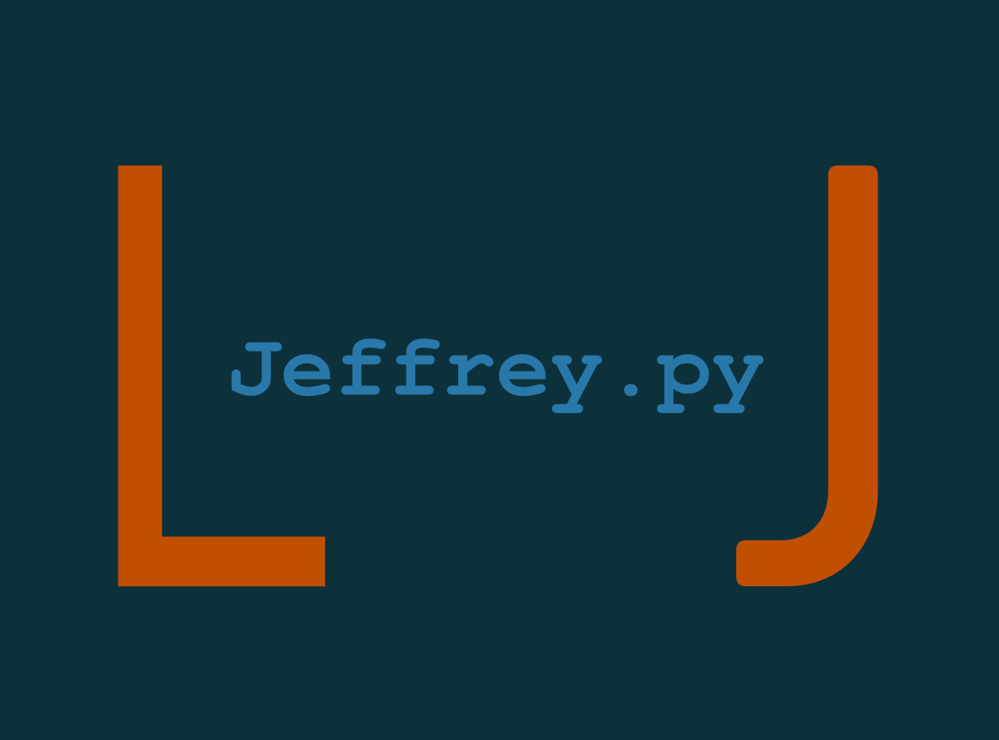

<h1 align=center>Chatbot mit Neural Network - Projektseite</h1>
<div align=center>
    </img>
</div>
<h3 align=center>von Jan Drewes (@LandingTheMoon) & 
Louis Lemberg (@MindOfUs)</h3>
<h3>----------------------------------------------------------------------------------------------------------------</h3>

## Übersicht

<ol>
    <li>
        <a href="#einführung">Einführung</a>
        <ol>
            <li>
                <a href="#gruppe">Die Gruppe</a>
            </li>
            <li>
                <a href="#idee">Die Idee</a>
            </li>
        </ol>
    </li>
    <li>
        <a href="#programme">Die verwendeten Programme</a>
        <ol>
            <li>
                <a href="#python">Python (Programmiersprache)</a>
            </li>
            <li>
                <a href="#vscode">VisualStudio Code (Programmierumgebung)</a>
            </li>
            <li>
                <a href="#anaconda">Anaconda (Distributionssoftware/Interpreter)</a>
            </li>
            <li>
                <a href="#pytorch">Pytorch (Neural Network)</a>
            </li>
            <li>
                <a href="#nltk">NLTK (Natural Language Toolkit)</a>
            </li>
            <li>
                <a href="#tk">tkinter (GUI)</a>
            </li>
        </ol>
    </li>
    <li>
        <a href="#chatbot">Der Chatbot</a>
        <ol>
            <li>
                <a href="#data">data.json</a>
            </li>
            <li>
                <a href="#nltk">nltk_utils.py</a>
            </li>
            <li>
                <a href="#model">model.json</a>
            </li>
            <li>
                <a href="#train">train.py</a>
            </li>
            <li>
                <a href="#chat">chat.py</a>
            </li>
            <li>
                <a href="#gui">gui_chatbot.py</a>
            </li>
        </ol>
    </li>
    <li>
        <a href="Stundenprotokoll.md">Stundenprotokoll</a>
    </li>
    <li>
        <a href="#sources">Quellen</a>
    </li>
    <li>
        <a href="#eigen">Eigenständigkeitserklärung</a>
    </li>
</ol>

## Einführung <a name="einführung"></a>

Im ersten Abschnitt unserer Projektseite werden wir zuerst einmal unsere Gruppe, sowie unsere Projektidee erklären.

### 1. Die Gruppe <a name="gruppe"></a>

Unsere Gruppe besteht aus Jan Drewes und Louis Lemberg, wir gehen beide in das Physikprofil der 11. Klasse. Für uns war von Anfang an klar, dass wir zusammen arbeiten wollen, da die Zusammenarbeit in anderen Projekten schon sehr gut funktioniert hat. Wir beide sind schon mit Grundkenntnissen in der Programmmierung durch kleinere vorausgegangenen Projekte in dieses Projekt gestartet. Deswegen haben wir uns eine etwas kniffeligere Aufgabe ausgesucht.
Bei uns gab es zu Beginn jedoch abgesehen von dem Projekt eine kleine extra Herausforderung, denn Louis war für die Zeit bis zu den Herbstferien wegen eines Schüleraustauschs in Frankreich. Dort hat er angefangen an dem Projekt zu arbeiten. 

### 2. Die Idee <a name="idee"></a>

Bei der Ideenfindung haben wir uns am Anfang sehr schwer getan. Eigentlich hätten wir gerne ein Projekt mit einem Arduino gemacht, da für uns beide die Arbeit mit einem kleinen Computer sehr spannend schien. Diese Idee mussten wir jedoch durch die am Anfang bestehende Distanz zwischen uns verwerfen. Dann haben wir uns darauf geeinigt keine externen Geräte zuverwenden, sondern einen Chatbot zuprogramieren. Um diesen aber ein wenig spannender zu gestalten, haben wir uns als Ziel gesetzt, mit einem Neural Network zu arbeiten. Dies war für uns beide komplett neu, hat uns aber sofort begeistert und interessiert. Und von da an ging alles seinen Lauf, wir haben damit begonnen die benötigten Programme zu intsallieren, welche wir unter <a href="#programme">den verwendeten Programmen</a> vorstellen. Nachdem wir uns mit den Programmen vertraut gemacht haben, haben wir mit dem Chatbot losgelegt. Anfangs wollten wir eigentlich einen Chatbot programmieren, welcher mathematische Probleme löst, diese Idee wurde jedoch durch das Neural Network zu zeitaufwändig, somit haben wir uns darauf konzentriert, einen Chatbot zu entwickeln, der ein normales Gespräch führen und dabei auf umfangreiche Eingaben des Users reagieren kann.

## Die verwendeten Programme <a name="programme"></a>

Im folgenden werden alle verwendeten Programme und Erweiterungen die maßgeblich zu unserem Projekt beigetragen haben vorgestellt.

### 1. Python (Programmiersprache) <a name="python"></a>

Als Programmiersprache haben wir uns Python ausgesucht, da es häufig in der Wirtschaft und Wissenschaft für Datenanalyse verwendet wird. Python eignet sich für die Programmierung eines Chatbots sehr gut, weil man die Eingabedaten analysieren muss, um die richtigen Antworten zu erzeugen.

### 2. VisualStudio Code (Programmierumgebung) <a name="vscode"></a>

Für die Programmierumgebung haben wir uns für VisualStudio Code (VSC) entschieden, da wir beide schon sehr gute Erfahrungen damit gemacht haben. VSC ist sehr übersichtlich, man kann zahlreiche individuelle Erweiterungen installieren, u.a. werden einem direkt eventuelle Tipp- bzw. Zeichenfehler angezeigt. Ein weiterer entscheidener Faktor für uns war, dass VSC mit GitHub kompatibel ist und man so gemeinsam an einem Projekt direkt zusammen arbeiten kann.

### 3. Anaconda (Distributionssoftware/Interpreter) <a name="anaconda"></a>

Als Python-Intepreter haben wir uns für Anaconda entschieden. Der Hauptgrund war, dass es mit Pytorch kompatibel ist, und wir auf Pytorch angewiesen waren. Zusätzlich hat Anaconda eine große Palette an Liberies, die man installieren und verwenden kann.
Anaconda ist allgemein für die Entwicklung von Anwendungen mit großen Datenmengen, wozu unser Projekt gehört, ausgelegt.

### 4. Pytorch (Neural Network) <a name="pytorch"></a>

test

### 5. NLTK (Natural Language Toolkit) <a name="nltk"></a>

test

### 6. tkinter (GUI) <a name="tk"></a>

Tkinter ist eine Python-Erweiterung, welche wir dafür benutzt haben die GUI von unserem Chatbot zu designen. Trotz anderer Moöglichkeiten haben wir und für tkinter entschieden, da es am häufigsten verwendet wird und somit die meisten Tutorials und Dokumentation hat.

## Der Chatbot <a name="chatbot"></a>

In der folgenden Sektion werden wir erklären, wie der Chatbot funktioniert. Dafür benötigen wir die folgenden 6 Dateien: <a href="#data">Data.json</a>, <a href="#nltk">nltk_utils.py</a>, <a href="#model">model.py</a>, <a href="#train">train.py</a>, <a href="#chat">chat.py</a> und <a href="#gui">gui_chatbot.py</a>. Alle Dateien bis auf Data.json sind in <a href="#python">Python</a> geschrieben. Für alle Dateien bis auf die Data.json und gui_chatbot.py haben wir uns größtenteils an folgender Seite <a href="https://www.python-engineer.com/posts/chatbot-pytorch/">https://www.python-engineer.com/posts/chatbot-pytorch/</a> orientiert, da es sich dabei um die Programmierung des Neural Networks ging, und wir beide vorher noch keine Erfahrung hatten. Wir haben uns den Code angesehen, verstanden und haben ihn deshalb auch ein wenig erweitert.

### 1. Data.json <a name="data"></a>

In der Datei Data.json haben wir die Daten hinterlegt, mit welcher der Chatbot trainiert wird. Dafür haben wir Listen nach folgendem Muster programmiert:

```
"intents": [
    {
        "tag": "",
        "patterns": [""],
        "responses": [""]
    }
]
```

Mit dem "tag" bestimmen wir den Namen von dieser Gruppe von "patterns" und "responses". Diesen haben wir immer so gewählt, dass er beschreibt was danach definiert wird. In "patterns" geben wir dem Chatbot durch Keywords, anhand welcher der Bot später erkennt, dass der User auf diesen "tag" zugreifen will. In der Liste-"responses" sagen wir dem Bot, was er antworten soll, wenn er einen von den davor definierten "patterns" erkennt. Dies sieht dann zum Beispiel anhand des "tags": "test" so aus:

```
"intents": [
    {
        "tag": "test",
        "patterns": ["test", "1,2,3"],
        "responses": ["Test succesful!"]
    }
]
```

### 2. nltk_utils.py <a name="nltk"></a>

In diesem Program legen wir drei Funktionen fest, die für die Verarbeitung von Eingaben (User und Data.json) wichtig sind. Dafür benutzen wie im Namen vom Program schon beschrieben <a href="#nltk">NLTK</a>.

```
def tokenize(sentence):
    return nltk.word_tokenize(sentence)
```
Die 'tokenize'-Funktion zerlegt die Eingabe vom User (Satz) in die einzelnen Worte, z.B. wird aus "How are you?", ["How", "are", "you", "?"].

```
def stem(word):
    return stemmer.stem(word.lower())
```
Die 'stem' bzw. 'stemmer'-Funktion bringt jedes Wort vom Input in die Grundform, so erkennt der Chatbot zum Beispiel in "plays", "playing" und "played", den immer wieder kehrenden Part "play".
```
def bag_of_words(tokenized_sentence, words):
    sentence_words = [stem(word) for word in tokenized_sentence]
    bag = np.zeros(len(words), dtype=np.float32)
    for idx, w in enumerate(words):
        if w in sentence_words: 
            bag[idx] = 1

    return bag
```
Die letzte Funktion in nltk_utils.py konvertiert die Eingabe vom User (Satz) in Zahlen, denn nur so kann Train.py den Input verarbeiten. Der Output der vorherigen Funktionen wird als Input verendet. Die Funktion zählt die Anzahl der Worte und wie oft sie vorkommen. Diese Information speichert in Form eines Arrays. Dies könnte z.B. so aussehen:

</img>

### 3. model.py <a name="model"></a>

Mit diesem Programm wird nun das 'Model' bzw. das Neural Network mit Hilfe von <a href="#pytorch">pytorch</a> erstellt. Dafür haben wir eine class mit folgenden zwei Funktionen drin:

```
def __init__(self, input_size, hidden_size, num_classes):  
        super(NeuralNet, self).__init__()
        self.l1 = nn.Linear(input_size, hidden_size)
        self.l2 = nn.Linear(hidden_size, hidden_size)
        self.l3 = nn.Linear(hidden_size, num_classes)
        self.relu = nn.ReLU()
```
Diese erste Funktion tut nichts anderes als das Neural Network aufzubauen bzw. erst einmal zu erschaffen.
```
def forward(self, x:                                          
        out = self.l1(x)
        out = self.relu(out)
        out = self.l2(out)
        out = self.relu(out)
        out = self.l3(out)
        return out
```
Diese zweite Funktion schickt die ganzen Daten durch jedes einzelne Layer des Neural Networks durch.
### 4. train.py <a name="train"></a>

In diesem Programm bringen wir nun alles was wir vorher in den anderen Programmen bereits festgelegt haben zusammen, und lassen den Chatbot lernen. 

### 5. chat.py <a name="chat"></a>

test

### 6. gui_chatbot.py <a name="gui"></a>

test

## Quellen <a name="sources"></a>

<ol>
    <li>
        <a href="https://www.python-engineer.com/posts/chatbot-pytorch/">https://www.python-engineer.com/posts/chatbot-pytorch/</a>
    </li>
    <li>
        <a href="https://short-funny.com/hilarious-jokes.php">https://short-funny.com/hilarious-jokes.php</a>
    </li>
</ol>

## Eigenständigkeitserklärung <a name="eigen"></a>

Wir bestätigen hiermit, dass unser Ergebnis, ein von uns eigens erschaffenes Produkt ist, und wir uns bei der Umsetzung einzig durch die angegebenen Quellen geholfen haben.
